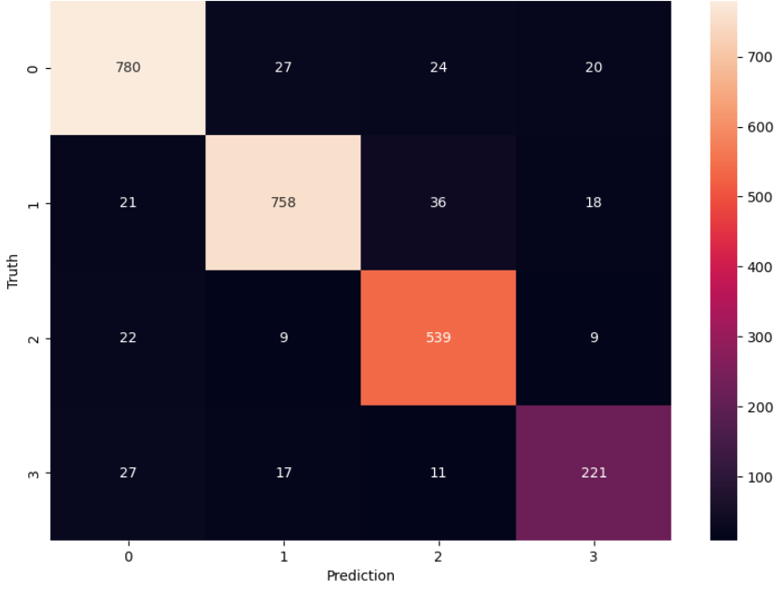

# 📰 News Category Classifiers

A multi-class text classification project that categorizes news articles into **Business, Sports, Crime, and Science** categories using Naive Bayes with SMOTE oversampling.

## 📊 Results at a Glance

| Metric             | Value           |
| ------------------ | --------------- |
| **Accuracy**       | 90.51%          |
| **Macro F1-Score** | 0.89            |
| **Dataset Size**   | 12,695 articles |

### Per-Class Performance

| Category | Precision | Recall | F1-Score |
| -------- | --------- | ------ | -------- |
| BUSINESS | 0.92      | 0.92   | 0.92     |
| SPORTS   | 0.93      | 0.91   | 0.92     |
| CRIME    | 0.88      | 0.93   | 0.91     |
| SCIENCE  | 0.82      | 0.80   | 0.81     |

### Confusion Matrix



_Confusion matrix showing model predictions vs actual labels_

## 🧠 Approach

This project explores multiple techniques for news classification:

1. **Bag of Words (1-gram)** → 89.37% accuracy
2. **1-gram + Bigrams** → 89.21% accuracy
3. **1-gram → Trigrams** → 88.89% accuracy
4. **With Text Preprocessing** (stopwords removal, lemmatization, + bigrams) → **90.51% accuracy** ✅

### Key Techniques Used

- **SMOTE (Synthetic Minority Oversampling)** - Handled class imbalance (SCIENCE had only 1,381 samples vs 4,254 for BUSINESS)
- **CountVectorizer** with n-gram ranges
- **Multinomial Naive Bayes** classifier
- **SpaCy** for lemmatization and stopword removal

## 📈 Original Dataset Distribution (Before SMOTE)

| Category | Count |
| -------- | ----- |
| BUSINESS | 4,254 |
| SPORTS   | 4,167 |
| CRIME    | 2,893 |
| SCIENCE  | 1,381 |

## 🛠️ Installation

```bash
# Clone the repository
git clone https://github.com/YOUR_USERNAME/news-category-classifier-BOW.git
cd news-category-classifier

# Install dependencies
pip install -r requirements.txt

# Download spaCy model
python -m spacy download en_core_web_sm

```

## 🙏 Acknowledgements

[](https://www.kaggle.com/code/hengzheng/news-category-classifier-val-acc-0-65)

Inspired by hengzheng's kernel which achieved 65% validation accuracy. This implementation achieves **90.51%** accuracy through SMOTE oversampling and text preprocessing techniques.
